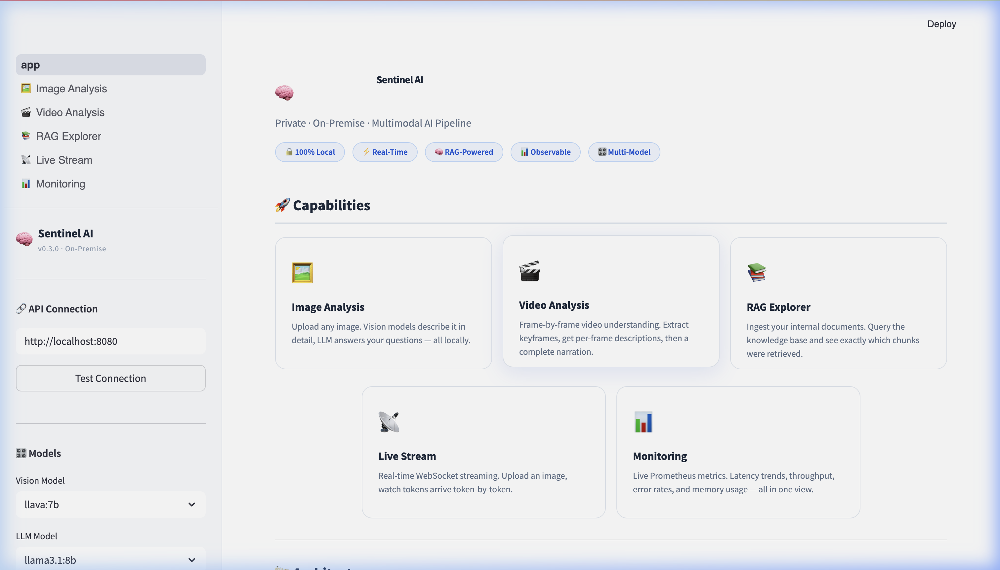
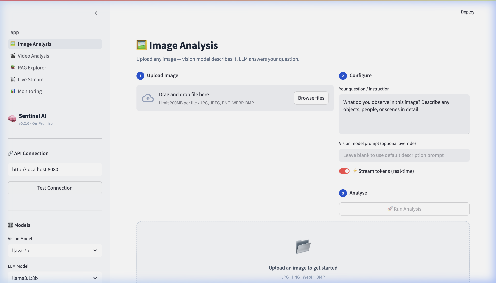

<div align="center">
  <h1>🧠 Sentinel AI</h1>
  <p><b>Private · On-Premise · Multimodal AI Pipeline</b></p>
  
  [](https://python.org)
  [](https://fastapi.tiangolo.com)
  [](https://streamlit.io)
  [](https://docker.com)
</div>

---

**Sentinel AI** is a fully local, privacy-first multimodal AI stack. It combines small vision models (like LLaVA and Florence-2) with large language models (via Ollama) and Vector RAG (ChromaDB) to analyze images, videos, and documents without sending your data to the cloud.

If a request contains non-sensitive public data, the built-in **Hybrid Router** can seamlessly offload it to high-end cloud models (like GPT-4o) while keeping confidential data local.

---

### UI Previews
<p align="center">
  
  
</p>

---

````carousel

<!-- slide -->

<!-- slide -->

````

## ✨ Features (Phases 1-10 Complete)

1. **🖼️ Image Analysis**: On-premise vision descriptions + LLM reasoning.
2. **🎬 Video Understanding**: Extract frames, analyze temporal sequences, and generate video narrations.
3. **📚 Multimodal RAG**: Ingest safety policies, manuals, and PDFs. The pipeline automatically retrieves context before generating answers.
4. **📡 Real-Time Streaming**: Stream SSE tokens live to the sleek, white-themed Streamlit frontend.
5. **🔀 Hybrid Router**: Built-in PII and sensitivity classifier. Automatically routes strict/confidential queries locally, and public queries to OpenAI.
6. **📊 Full Observability**: OpenTelemetry tracing + Prometheus metrics + Grafana dashboards + Jaeger.
7. **🛠️ Fine-Tuning Scaffolding**: Built-in scripts to build datasets and PEFT/LoRA fine-tune Florence-2 or LLaVA.

### Phase 11: Enterprise Next.js Overhaul
- **React/Next.js Migration**: Replaced simplistic Streamlit prototypes with an App Router-backed React application for maximum depth and aesthetic control.
- **Google Labs Aesthetics**: Curated a `Desert Sand` and `Terracotta Orange` TailwindCSS v4 schema mapping fluid Framer Motion animations to elevated shadow cards.
- **Native DOM Streaming**: Bypassed polling limitations by constructing native `Fetch API` chunk sequence decoders rendering the massive multi-modal inference payloads instantly.

### Phase 12: Active Live Monitoring (The Sentinel)
- **WebRTC Camera Hook**: Taps the physical device's webcam natively in the browser leveraging `navigator.mediaDevices`.
- **FastAPI WebSockets**: Bi-directional asynchronous TCP pipelines (`ws://localhost:8080/live/stream`) ingesting multi-megabyte canvas snapshots continuously.
- **Dynamic Tripwires**: Natural language rule-setting (e.g., *"Is there a person?"*) continuously parsed against live video streams. 
- **Autonomous Incident Matrix**: Flags breaches in real-time, dumping localized vision contexts into a responsive Threat Matrix sidebar.

---

## 🏗️ Architecture

```text
       ┌───────────────┐
       │   Streamlit   │  (Port 8501)
       │    Frontend   │
       └───────┬───────┘
               │ HTTP / WS
       ┌───────▼───────┐
       │  FastAPI App  │  (Port 8080)
       │ Hybrid Router │──[ Cloud Fallback (GPT-4o) ]
       └───────┬───────┘
               │
    ┌──────────┼──────────┐
    ▼          ▼          ▼
 ┌──────┐   ┌──────┐   ┌──────┐
 │Vision│   │ LLM  │   │ RAG  │
 │Model │   │Ollama│   │Chroma│
 └──────┘   └──────┘   └──────┘
               │
       ┌───────▼───────┐
       │ Observability │  (Prometheus, Grafana, Jaeger)
       └───────────────┘
```

---

## Quickstart

1. Clone repo, source venv, run `pip install -r requirements.txt`.
2. Start API: `uvicorn api.main:app --port 8080`.
3. Start UI: `cd web && npm run dev`. Access at `localhost:3000`.
# Grafana:  http://localhost:3000 (admin / sentinel123)

```bash
# 1. Start Ollama and pull models
ollama serve
ollama pull llama3.1:8b
ollama pull llava:7b

# 2. Install dependencies
python3 -m venv .venv
source .venv/bin/activate
pip install -r requirements.txt

# 3. Start API Server (Terminal 1)
uvicorn api.main:app --port 8080 --reload

# 4. Start Frontend (Terminal 2)
streamlit run frontend/app.py --server.port 8501
```

---

## 🔌 API Reference

The FastAPI backend exposes the following key endpoints:

| Endpoint | Method | Description |
|---|---|---|
| `/analyze/image` | `POST` | Full pipeline sync response (Vision + LLM + RAG) |
| `/analyze/image/stream` | `POST` | Server-Sent Events (SSE) streaming tokens |
| `/analyze/video` | `POST` | Frame extraction + sequential analysis + narration |
| `/route/image` | `POST` | Hybrid Router: routes to local/cloud based on PII |
| `/rag/ingest` | `POST` | Upload a `.txt`/`.pdf` into the ChromaDB vector store |
| `/ws/analyze` | `WS` | Real-time WebSocket connection for streaming |

---

## 🛠️ Configuration

Sentinel AI uses `.env` files and `core.config.py` for settings.

```env
# Example .env
DEFAULT_VISION_MODEL=llava:7b
OLLAMA_LLM_MODEL=llama3.1:8b
OLLAMA_BASE_URL=http://localhost:11434
DEVICE=mps  # Use 'cuda' for NVIDIA, 'cpu' for standard servers
OPENAI_API_KEY=sk-... # Optional: For Hybrid Routing
```


---

## 📄 License & Acknowledgements

- **License**: Apache 2.0
- Built with [FastAPI](https://fastapi.tiangolo.com/), [Ollama](https://ollama.com), [Streamlit](https://streamlit.io), and [Hugging Face Transformers](https://huggingface.co/docs/transformers/index).
- Maintained by [@Phani3108](https://github.com/Phani3108).
